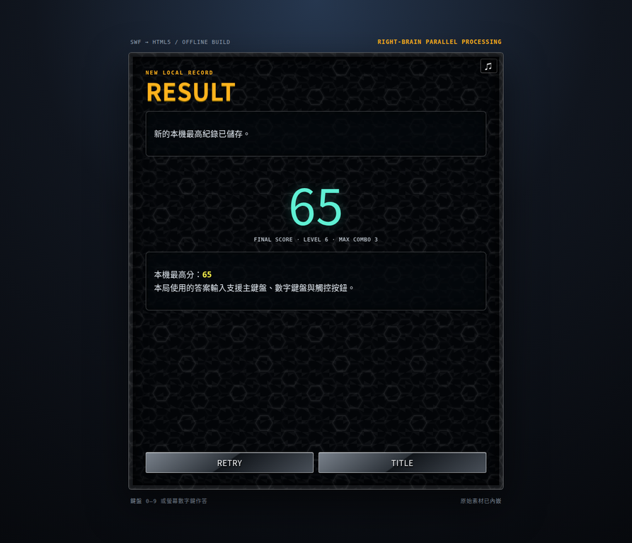

# 《右腦並列處理》HTML5 現代重製版

> **這是一個以使用者提供之 Flash 原檔 `sanouheiretu.swf` 為分析對象的相容性重製。**成品不是 Flash 模擬器包裝，而是以原生 HTML、CSS 與 JavaScript 重新實作的離線單檔遊戲；不使用框架、CDN、套件或任何網路請求。

[直接開啟遊戲](./sanou-modern.html)

## 專案目標與交付範圍

原始作品是版本 6 的壓縮 SWF，舞台大小為 **300×350 px**，含 165 個主時間軸畫格、原生 ActionScript 1/2 邏輯、22 張圖片與 5 段聲音。本專案將核心「同時處理解題面板」的玩法、遞增難度、連擊、生命、計分與原有視覺氣氛重寫為現代瀏覽器可直接執行的遊戲。舊版依賴的遠端 CGI 排名服務已不再可用，因此改成使用瀏覽器的本機紀錄保存。

| 交付物 | 說明 | 依賴／網路狀態 |
|---|---|---|
| [`sanou-modern.html`](./sanou-modern.html) | 完整可玩的遊戲單檔，含 HTML、CSS、JavaScript、圖片與聲音 | **零外部依賴；離線可用** |
| [`README.md`](./README.md) | 本繁體中文逆向與技術文件 | GitHub 顯示用 |
| [`docs/preview-result.webp`](./docs/preview-result.webp) | 遊戲實測結果畫面 | README 預覽用，不是執行時依賴 |

## 如何執行

下載或複製 `sanou-modern.html` 後，以任一現代瀏覽器直接開啟即可。因為所有媒體均以 Base64 資料 URI 嵌入，不需要啟動本機伺服器，也不會向網路載入字型、圖片、音效或程式碼。首次點擊 START、DRILL 或數字鍵後，瀏覽器才會允許播放內嵌聲音；這是現代自動播放政策所需的使用者互動門檻。

| 操作 | 鍵盤／觸控方式 | 行為 |
|---|---|---|
| 作答 | 主鍵盤 `0–9`、數字鍵盤 `0–9` 或螢幕數字鍵 | 解答任一可見面板的單位數答案 |
| 開始一般模式 | 點擊 `START` | 從加法開始，依時間逐步開放運算並增加面板數 |
| 單項練習 | 點擊 `DRILL` 後選擇 `＋ × − ÷` | 鎖定一種運算，仍保留題目壓力遞增 |
| 靜音 | 右上角 `♫` 按鈕 | 切換內嵌音效與背景音樂 |
| 結束本局 | 遊戲中按 `Escape` | 回到標題畫面 |

## 逆向結果

透過解壓 SWF 標籤、匯出素材與反編譯 ActionScript，可確認遊戲不是單題計算器，而是要求玩家在多個同步出現的問題中快速辨認出**任何一題**的答案並按下單一數字。原版將題目儲存於 `m1` 至 `m10` 影片片段，並以 `Key.isDown()` 同時監聽主鍵盤和數字鍵盤的 0–9。輸入後，控制器掃描尚未完成的面板；找到相符答案便加分、銷毀該面板並補題，否則會扣除生命。

| 原版元件／程式行為 | 反編譯觀察 | 新版對應實作 |
|---|---|---|
| `onClipEvent(enterFrame)` | 以 Flash 畫格週期累計時間、產生題目及處理鍵盤 | 使用 `requestAnimationFrame`、`performance.now()` 與 delta time；不依賴固定幀率 |
| `m1…m10` 面板 | 最多十個活躍題目，每個有 `setumon` 與 `kotae` | 以 `active` 陣列保存 `{ id, expression, answer, slot }` 物件，並用 DOM 面板渲染 |
| `Key.isDown(48…57,96…105)` | 支援主鍵盤與數字鍵盤 0–9 | 單一 `keydown` 監聽器，搭配螢幕 0–9 按鈕，支援桌面與觸控 |
| `l_time.nextFrame()` | 錯答推進生命條；連擊時回復生命 | 以 0–100 的連續生命值、CSS 生命條及平滑減損取代畫格式生命條 |
| `SharedObject.getLocal()` | 保存成績與一次性的網路排名提交權限 | 以 `localStorage` 保存本機最高分與遊玩次數；沒有對外傳輸 |
| `LoadVars` / `sanou2.cgi` | 讀寫遠端網路排行榜 | 移除失效 CGI；以 `RECORD` 顯示本機離線紀錄 |

### 題型與難度曲線

原始控制器每滿十秒便提升 `m_level`，並隨等級調整同時存在的題目上限 `k_level` 和答對分數。新版保存相同的 32 段分數表及四階段開放邏輯，而將時間判定改成毫秒，故不同螢幕刷新率下都能維持穩定節奏。所有出題都被約束為 **0–9 的整數答案**，以符合原作「按一個數字即可回答」的設計。

| 進程 | 可用運算 | 題目壓力 | 原始邏輯保留方式 |
|---|---|---|---|
| 第 1–4 關 | 加法 | 3 → 6 個面板 | 加數總和不超過 9 |
| 第 5–8 關 | 加法、乘法 | 7 → 10 個面板 | 乘積限制為 0–9 |
| 第 9–12 關 | 加法、乘法、一位數減法 | 7 → 10 個面板 | 被減數不小於減數，答案為 0–9 |
| 第 13 關起 | 加法、乘法、減法、整除 | 7 → 10 個面板 | 除法只產生可整除且商為 0–9 的組合 |
| 第 17／26／29 關起 | 增加二、三位數減除題 | 7 → 10 個面板 | 保留原版難度意圖，維持單位數答案 |

> **保真與修正。**原始程式在答案掃描迴圈中會走到 `m11`，但初始化只建立 `m1` 至 `m10`。新版使用陣列長度掃描，因此修正了這個越界條件，同時不改變「按下一次數字只會解掉第一張相符面板」的遊戲結果。

## 現代化架構

單檔不代表將遊戲邏輯混成難以維護的程式。程式在閉包內維持明確的狀態邊界：畫面狀態負責主選單與結果頁切換，遊戲狀態負責本局數值和面板資料，題目工廠保證可解性，渲染函式只處理 DOM，音效層則在使用者互動後控制原始音檔。這些界線讓代碼能避免原始 ActionScript 使用大量 `_global` 和 `_root` 所產生的耦合。

| 層級 | 主要責任 | 關鍵資料或 API |
|---|---|---|
| 畫面狀態 | `title`、`explain`、`drill`、`playing`、`result`、`record` 的切換 | `renderTitle()`、`renderGame()`、`renderResult()` |
| 遊戲狀態 | 生命、分數、連擊、等級、活躍題目和關卡計時 | `state.game` |
| 規則與題目 | 依等級決定可用運算、面板上限、分數；產生可解題目 | `levelConfig()`、`makeProblem()` |
| 更新迴圈 | 生命遞減、十秒升級、定時補題與遊戲結束判定 | `tick(now)`、`requestAnimationFrame()` |
| 互動 | 鍵盤、觸控數字鍵、選單、靜音 | `keydown`、事件委派 `click` |
| 持久化 | 最高分與遊玩次數的本機保存 | `localStorage` 與容錯包裝 `safeStore` |
| 音效 | 內嵌 MP3 的延遲初始化、BGM 循環、短音效重播 | `Audio`、`initAudio()`、`playSound()` |

CSS 使用 `aspect-ratio: 6 / 7` 保留原 SWF 300×350 的舞台比例，同時讓容器在桌面和行動裝置自動縮放。蜂巢底紋、金屬按鈕、黃橘標題、紅色壓力條與隨機攝影背景都承接原作的視覺語言；但焦點外框、ARIA 標籤、文字型生命值、螢幕數字鍵及 `prefers-reduced-motion` 支援則是新增的可及性改善。

## 原始素材處理

所有遊戲執行所需的素材來自提供的 SWF。沒有重新下載第三方素材，也沒有將圖片或聲音保留為外部執行時檔案。產生階段會將已匯出的媒體編碼成 data URI，寫入 `const ASSETS`；因此 HTML 在檔案系統開啟時仍能完整顯示與播放。

| 類型 | 原始 SWF 字元 ID | 重製版用途 | 內嵌方式 |
|---|---:|---|---|
| 蜂巢背景 | 78 | 標題、說明、紀錄與結算畫面底紋 | PNG data URI |
| 蜜蜂插圖 | 9 | 標題頁小型原作識別元素 | PNG data URI |
| 攝影背景 | 120–158，共 20 張 | 一般模式的隨機關卡背景 | PNG data URI 陣列 |
| 短音效 | 1–4 | 正答、錯答、介面及連擊回饋 | MP3 data URI |
| 音樂 | 5 | 遊戲中的循環背景音樂 | MP3 data URI |

單檔成品約 **7.0 MiB**。這個大小是完全離線與使用原始素材的取捨；若部署到網站，可將 `ASSETS` 抽離成受版本控制的靜態檔案以加快首次解析，但那將不再符合本專案的「單一 HTML、零相依」交付要求。

## 驗證紀錄

測試使用本機 `file://` 開啟成品，確認主選單、標題、蜂巢底紋和內嵌蜜蜂圖都不需網路即可顯示。一般模式可正確產生多張面板，輸入正解後會消除面板、補題、增加分數與連擊；錯答會重置連擊並扣除生命。生命耗盡後會顯示 RESULT 畫面，並把最高分寫入本機紀錄。

| 驗證面向 | 結果 |
|---|---|
| 單一 HTML | 通過；`sanou-modern.html` 是唯一執行檔 |
| 外部資源 | 通過；靜態掃描沒有 `http(s)` 圖片、音效、CSS 或 JavaScript 參照 |
| 內嵌媒體 | 通過；包含 22 個 PNG 與 5 個 MP3 data URI |
| JavaScript 語法 | 通過 Node.js 語法檢查 |
| 遊戲正答／錯答 | 通過；分數、連擊、生命、補題及回饋可見 |
| 結算與持久化 | 通過；RESULT 與 `localStorage` 高分可見 |
| 瀏覽器控制台 | 通過；沒有應用程式未處理錯誤 |

## 已知差異與刻意取捨

原始的網路排名 CGI 已不存在，並且將分數送往第三方伺服器不符合離線重製的目標，因此本版改採私密的瀏覽器本機紀錄。Flash 中一些隨時間軸播放的破碎動畫、角色向量遮罩與舊版預載畫面，被替換為 CSS 面板淡出、壓力條與畫面震動，目的是在沒有 Flash Runtime 的情況下維持清楚的操作回饋與可維護性。

此外，原 SWF 的 ActionScript 有把時間更新綁在畫格數的寫法；新版改用 `performance.now()` 和 `requestAnimationFrame()`，避免高刷新率、背景分頁或不同裝置造成遊戲速度不一致。這是保留遊戲規則但改善執行可靠性的刻意現代化調整。

## 授權與素材說明

本重製版使用的視覺與音訊素材僅來自本次工作流程中由使用者提供的 SWF。請在具備原作品與素材使用權的前提下使用、分發或公開部署本專案。程式重製碼採用原生網頁標準，不含第三方程式庫。

## 參考來源

[1] 使用者提供的原始遊戲檔：`sanouheiretu.swf`（Macromedia Flash v6，於本次重製流程中進行離線分析；未併入本儲存庫）。
