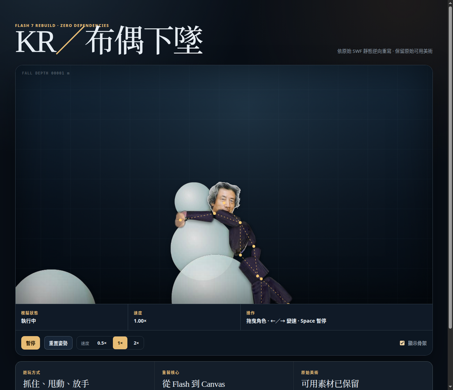

# KR／布偶下墜：零相依現代重製



這個目錄將使用者提供的舊版 `kr.swf` 重新實作為可在現代瀏覽器執行的靜態 Canvas 遊戲。成品**不含框架、套件、CDN、追蹤碼或外部網路請求**；它以原始 SWF 中可抽取的角色與障礙物美術，搭配原生 HTML、CSS 和 JavaScript 重建「拖曳布偶並一路下墜」的核心體驗。

> **重製定位。** 這不是把 SWF 包進網頁，也不會執行原始 ActionScript。所有行為皆依靜態分析後以現代 JavaScript 重新撰寫；原始素材只在可辨認用途下保留。[1]

## 特色

| 面向 | 實作內容 |
|---|---|
| 核心玩法 | 按住角色關節拖曳、甩動、放手；讓布偶持續穿越會重生的圓形障礙物。 |
| 原始美術 | 由 SWF 的 `DefineBitsJPEG3` 還原為透明 PNG，包括頭部、服裝、手腳與大圓障礙物。 |
| 物理 | 固定子步進 Verlet integration、距離骨段、姿態相對角度限制與粒子／圓形投影碰撞。 |
| 輸入 | Pointer Events，同時支援滑鼠、觸控與觸控筆。[2] |
| 可用性 | 高 DPI Canvas、響應式版面、可見鍵盤焦點、暫停、重置、速度切換與骨架檢視。 |
| 相依性 | **零執行期相依**；沒有 npm 安裝、建置工具或第三方 JavaScript。 |

## 快速開始

`index.html` 是入口頁面。現在可以**直接雙擊或以 `file://` 開啟**，不需要本機伺服器；CSS、三個傳統 JavaScript 腳本和 9 個 PNG 都會以相對檔案路徑離線載入。先前使用 ES Modules 會在 Chromium 的 `file://` opaque origin 下被 CORS 載入規則阻擋，現已改為依序載入的傳統腳本，並以受控全域 API 連接物理、繪圖與遊戲控制。

若要透過 HTTP 測試或嵌入其他網站，也可選擇啟動任意靜態伺服器：

```bash
cd kr-swf-modern-rebuild
python3 -m http.server 8080
```

接著在瀏覽器開啟 <http://localhost:8080>。上述 Python 指令只提供靜態檔案，**不是專案相依套件**。

| 操作 | 行為 |
|---|---|
| 滑鼠、手指或觸控筆按住角色 | 選取游標附近的關節並以阻尼拖曳。 |
| 放開指標 | 解除抓取，保留原有慣性。 |
| `←`／`→` | 以 0.1× 調整模擬速度，範圍為 0.25× 到 3×。 |
| `Space` | 暫停或繼續模擬。 |
| `R` | 將角色與障礙物重置到初始場景。 |
| 「顯示骨架」 | 顯示距離骨段與粒子關節，用於觀察物理約束。 |

## 從原作推導的機制

原始 `kr.swf` 是一個單場景物理玩具，而非關卡式遊戲。它的 Flash 7 時間軸為 550 × 400 px、50 FPS，共兩個主幀：第一幀宣告 `Particle2D`、`Constraint`、`AngledConstraint`、`PEngine2D` 等 AS2 類別；第二幀建立人物、30 顆隨機圓形障礙物、相機跟隨，以及滑鼠與鍵盤控制。[1]

角色由 12 個關節粒子組成，外觀則以 11 條肢體段呈現。每段圖像的中心放在兩關節中點，並以兩點的 `atan2` 方向旋轉，因此美術能隨物理骨架自然扭轉。原作在拖曳時不是移動單一精靈，而是把滑鼠附近的**所有**關節向游標位置拉近；此一細節也被保留，讓抓住肩膀、軀幹或四肢時都有不同的布偶感。

| 子系統 | 原作證據 | 本重製行為 |
|---|---|---|
| 粒子 | `Particle2D` 保存 `x`、`y`、`oldx`、`oldy`、`mass`。 | `Particle` 保存目前／前一位置、質量、半徑與反質量。 |
| 骨段 | `Constraint` 維護 `restLength`。 | 依反質量比例修正兩端，將距離拉回骨段初始長度。 |
| 關節 | `AngledConstraint` 保存第三粒子與角度區間。 | 以初始相對角為零位，限制各肘、膝、頭頸與軀幹可偏離的角度。 |
| 掉落軌道 | `Track.create()` 建立 30 顆球；越過角色上方即回收。 | 30 顆帶種子的圓障礙物向角色下方重生，保留無限下墜視覺。 |
| 相機 | 未抓取時平滑追蹤第一粒子。 | 以帶阻尼的相機追蹤頭部，拖曳時停止追蹤避免搶走控制權。 |

## 技術設計

### Verlet 位置式積分

此專案使用 Verlet integration，避免額外保存顯式速度。令目前位置為 $x_t$、前一位置為 $x_{t-1}$、阻尼為 $d$、重力為 $g$、固定時間步進為 $\Delta t$，則每一粒子的基礎更新可寫成：

```text
v_t      = (x_t - x_(t-1)) × d
x_(t+1)  = x_t + v_t + g × Δt²
```

這個形式與原 AS2 將「目前位置減去舊位置」作為速度的作法相符，但現代重製把更新改為 **120 Hz 固定子步進**。`requestAnimationFrame` 的實際時間差會累積到一個有上限的緩衝區，再執行固定數量的物理解算。這可避免高刷新率螢幕使模擬加速，亦限制頁籤恢復時巨大的時間差造成角色瞬間穿透。

### 約束解算與碰撞

每個固定子步進執行三輪「角度約束 → 距離約束 → 碰撞投影」。距離約束計算目前骨段距離 $L$ 與目標長度 $L_0$ 的誤差，再依兩端反質量比例反向移動。角度約束會先記錄初始姿態中的相對關節角；運行時只限制相對此姿態的偏移，而不是比較絕對世界角，避免翻轉或跨越 $-π/π$ 邊界時發散。

角色粒子和每顆障礙物都是圓。當中心距離小於兩半徑之和時，粒子沿接觸法線推出重疊量。零距離時改用決定性的角度方向，因此不會因除以零而產生 `NaN`。這是比原作更穩健的防護，但沒有改變障礙物固定、角色可碰撞的主要手感。

### 素材還原

`DefineBitsJPEG3` 並非一般的透明 JPEG；它由 JPEG 位元流與獨立的 zlib Alpha 位元流組成。分析時先抽取 JPEG，再依影像寬高解壓 Alpha 成為單通道圖，最後與 RGB 合併為 RGBA PNG。這些檔案直接隨專案保存，執行時不會要求 Flash Player 或遠端圖庫。

| 原始 Character ID | 檔案 | 使用方式 |
|---:|---|---|
| 1、4、7 | `original_character_1/4/7.png` | 大腿、胸口、腹部。 |
| 8、14、20 | `original_character_8/14/20.png` | 手部與手臂。 |
| 11、17 | `original_character_11/17.png` | 頭部、小腿與鞋。 |
| 23 | `original_character_23.png` | 30 顆可回收障礙物。 |

## 專案結構

```text
kr-swf-modern-rebuild/
├── index.html                        # 語義化頁面與控制介面
├── css/
│   └── styles.css                    # 響應式介面與 Canvas 容器樣式
├── js/
│   ├── physics.js                    # Verlet、約束、碰撞與拖曳選取
│   ├── renderer.js                   # 高 DPI Canvas、相機與原始美術繪製
│   └── game.js                       # 場景、輸入、UI 與固定更新迴圈
├── assets/original/                  # 從 SWF 還原的透明 PNG
└── docs/
    ├── reverse-engineering-notes.md  # 詳細靜態逆向工程紀錄
    ├── as2-physics-analysis.md       # 原始 AS2 物理公式、控制流程與 20 條約束
    ├── original-rig.json              # 從 SWF 靜態抽取的 12 粒子／20 約束資料
    ├── offline-validation.md          # file:// 載入問題的修正與驗證證據
    └── rebuild-preview.webp           # 經瀏覽器驗證的成果預覽
```

這種分層讓 `index.html` 保持為純結構入口，而物理、繪圖與互動互不耦合。它也便於替換素材、調整約束或將遊戲嵌入其他靜態網頁。

## 驗證結果

| 測項 | 方法 | 結果 |
|---|---|---|
| JavaScript 語法 | `node --check` 檢查三個模組。 | 通過。 |
| 物理穩定性 | 以初始骨架連續執行 240 個 120 Hz 子步進。 | 所有粒子座標均為有限值，無 `NaN`／無限值。 |
| 素材 | 由 JPEG3 主影像及解壓 Alpha 合成 PNG。 | 9 個原始點陣素材可載入。 |
| 瀏覽器（HTTP） | Chromium 實際載入、觀察 Canvas 及 UI。 | 人物、障礙物、骨架視圖、暫停、預設速度與鍵盤變速均正常。 |
| 瀏覽器（`file://`） | 直接開啟本機 `index.html`。 | 三個一般腳本與 9 個原始 PNG 均載入，人物及障礙物正常呈現。 |
| 外部相依 | 掃描 HTML、CSS、JavaScript 的 URL 和 import。 | 無外部執行期資源或套件。 |

## 已知差異與界線

為確保新瀏覽器上的穩定性，本重製並不逐指令模擬 Flash VM。原作使用以毫秒為單位的動態 `timeFactor`，且每影格只迭代兩次；本作改為固定時間步進及三輪約束解算。原作的滑鼠事件也已轉為 Pointer Events。上述差異是可控的工程更新，而角色骨架、原始美術、拖曳阻尼、重力下墜、碰撞障礙物、相機與左右鍵變速皆保留原作精神。

完整 SWF 標籤、ActionScript 類別、常數與素材清單請見 [逆向工程紀錄](docs/reverse-engineering-notes.md)。若要查看逐行導出的更新順序、Verlet 公式、距離／角度投影、20 條約束與相機公式，請閱讀 [AS2 物理深度解析](docs/as2-physics-analysis.md) 與對應的 [機器可讀骨架資料](docs/original-rig.json)。關於本次 `file://` 載入失敗的根因、改動與瀏覽器驗證，請見 [離線開啟驗證](docs/offline-validation.md)。

## 授權與致謝

原始 SWF 與其中美術由使用者提供。本專案保留能從該檔案中解析的素材，只用於本次相容性重製。原作者、原始授權與再散布條款未能在檔案內確認；公開發行前請先完成權利查核。重製的 HTML、CSS 與 JavaScript 程式碼由 Manus AI 撰寫。

## 參考資料

[1]: docs/reverse-engineering-notes.md "本專案的 `kr.swf` 靜態逆向工程紀錄"
[2]: https://developer.mozilla.org/en-US/docs/Web/API/Pointer_events "MDN Web Docs — Pointer events"
